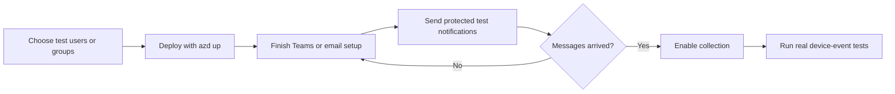
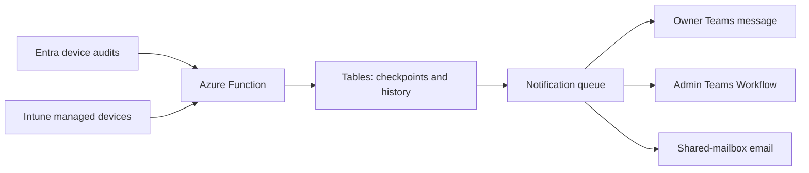

# Device notifications for Microsoft Entra and Intune

This template tells users and administrators when:

- a device is registered in Microsoft Entra ID;
- a device is enrolled in Microsoft Intune; or
- an Intune device changes to a problem state such as noncompliant, error, grace period, or unknown.

Notifications can go to the device owner, an administrator, or both. Supported destinations are a personal Teams message, a Teams Workflow, and email from one shared mailbox.

> [!IMPORTANT]
> This solution only detects and notifies. It never deletes, disables, retires, or wipes a device, changes compliance, or performs another remediation action.

## How setup works

Collection starts **paused**. Nothing is polled until an administrator has reviewed the scope and proved the selected notification paths.



## Before you begin

Start with test users or a test group. Decide which notification path you will prove before you enable collection.

Install:

- [Azure Developer CLI](https://learn.microsoft.com/azure/developer/azure-developer-cli/install-azd)
- [Azure CLI](https://learn.microsoft.com/cli/azure/install-azure-cli)
- [PowerShell 7](https://learn.microsoft.com/powershell/scripting/install/installing-powershell)

Node.js and npm are not required on administrator workstations. The reviewed, ready-to-run Function code—including its application, Azure SDK, and Bot Framework dependencies—is included in [`function-package`](function-package). `azd` deploys it without running npm or building source code. The readable TypeScript source remains in [`src`](src) for review by people or coding agents.

If you use email, install the Exchange Online PowerShell module:

```powershell
Install-Module ExchangeOnlineManagement -Scope CurrentUser
```

### Administrator access

| Access | Why it is needed |
|---|---|
| Azure Owner, or Contributor plus User Access Administrator | Create Azure resources and managed-identity assignments |
| Privileged Role Administrator | Assign the exact Microsoft Graph application permissions |
| Teams Administrator | Upload and approve the custom Teams app when personal messages are selected |
| Teams Workflow owner | Own the administrator channel or chat Workflow |
| Exchange Administrator | Limit email sending to one shared mailbox |

The Azure CLI, Azure subscription, and `azd` environment must use the same tenant. Normal operating-system or browser sign-in is used; device-code authentication is not used. See [Identity and permissions](docs/identity-and-permissions.md) for the exact roles and runtime permissions.

## Choose where messages go

| Destination | Recipient | What you prepare |
|---|---|---|
| Personal Teams message | Device owner | Upload and approve the generated Teams app, then install it for test users |
| Teams Workflow | Administrators | Create the Workflow, add a co-owner, and copy its callback URL before `azd up` |
| Shared-mailbox email | Owners or administrators | Choose one shared mailbox; setup limits the app to that mailbox |

Choose the personal Teams bot when owners should receive notifications inside Teams. Choose email when you prefer mailbox delivery without Bot Service or a custom Teams app. You may enable both. The bot resources are created only when personal Teams messages are selected.

At least one route is required. An administrator route is strongly recommended. Empty user and group lists mean **all discovered users**, so the setup wizard requires an explicit all-users confirmation.

## Deploy

This repository does not yet have a stable release. Use the default branch only for review and test deployments:

```powershell
azd init --template nathanmcnulty/azd-device-notifications
azd up
```

The setup wizard asks you to:

1. Choose users, groups, or explicitly confirm all users.
2. Choose owner and administrator notification paths.
3. Enter the required Teams Workflow or email details.
4. Choose whether existing recent enrollments should generate messages. The recommended first-run value is `0`, which creates a baseline without sending old enrollment notifications.
5. Review everything before Azure or tenant changes begin.

Rerunning `azd up` reuses and rechecks saved choices. No Node.js installation or npm package restore is performed on the administrator workstation or in Azure.

After a `v1.0.0` release exists, production deployments should pin it:

```powershell
azd init --template nathanmcnulty/azd-device-notifications --branch v1.0.0
```

## Finish setup and prove delivery

Complete only the destinations you selected:

1. **Personal Teams messages:** upload `teams-app/device-notifications.zip` in the Teams admin center, approve it, and install it for each test user.
2. **Teams Workflow:** confirm the Workflow has a durable co-owner, then verify both a successful run and the message in the intended channel or chat.
3. **Email:** `azd up` configures mailbox-limited Exchange access. If the step was interrupted or the mailbox changes, follow [Deployment](docs/deployment.md#6-configure-shared-mailbox-email).

While collection is still paused, run:

```powershell
./scripts/Test-Deployment.ps1
./scripts/Test-Deployment.ps1 -TestDelivery
```

The second command sends `[TEST]` notifications through the real delivery code. Confirm that every expected Teams card and email arrives. An HTTP success alone is not proof that a person received the message.

`Test-Deployment.ps1` writes a schema-validated, secret-redacted report to
`reports/deployment-validation.json`. Use `-Plan` to inspect the checks without
authentication, cloud requests, endpoint probes, or delivery.

When every selected path works, enable collection:

```powershell
./scripts/Enable-NotificationCollection.ps1
```

Finally, generate approved real registration, enrollment, and compliance events for the test scope. Synthetic tests prove delivery; real events prove Graph polling and detection.

## What is deployed



The Azure Function polls supported Microsoft Graph v1.0 endpoints. Azure Tables keep checkpoints, device snapshots, fingerprints, Teams conversation references, and delivery history. Azure Queue Storage separates detection from delivery. Application Insights and Log Analytics provide operational evidence.

Azure resources can incur charges. Review the selected region, polling scope, and retention needs before production use. See [Architecture and boundaries](docs/architecture.md) for retry and security details.

## Common choices

- Start with a dedicated test group instead of all users.
- Keep the enrollment lookback at `0` for the first run.
- Configure at least one administrator route.
- Do not enable a route until its destination is ready.
- Keep Teams Workflow callback URLs private; treat them like passwords.
- Export records your organization must retain before cleanup.

Advanced settings—including per-event routes, schedules, exclusions, privileged users, and quiet hours—are documented in [Configuration](docs/configuration.md).

## Documentation

| Guide | Use it for |
|---|---|
| [Deployment](docs/deployment.md) | Detailed Teams and Exchange setup |
| [Identity and permissions](docs/identity-and-permissions.md) | Administrator roles and runtime access |
| [Configuration](docs/configuration.md) | Scope, routes, schedules, and exclusions |
| [Operations](docs/operations.md) | Tests, monitoring, troubleshooting, and teardown |
| [Privacy and retention](docs/privacy.md) | Stored data, credentials, retention, and purge limits |
| [Architecture](docs/architecture.md) | Polling, delivery, retries, and security boundaries |
| [Notification contracts](docs/notification-contracts.md) | Versioned event mappings, safe route results, and upgrade sequencing |

## Cleanup

Export any history that must be retained, then run:

```powershell
azd down --purge --force
```

Cleanup removes only Exchange objects recorded as created by this environment. It does not remove the Teams custom app, Teams app assignments, administrator-owned Workflows, or adopted Exchange objects. Follow the [teardown checklist](docs/operations.md#teardown).

## For contributors

Contributors need Node.js 22 to run tests and rebuild the committed runtime. Administrators deploying with `azd` do not.

```powershell
Set-Location ./src
npm ci
npm test
npm run typecheck
npm run build
npm run bundle
```

Continuous integration rebuilds `function-package/index.cjs` and rejects a change when the committed runtime does not exactly match the reviewed source. GitHub marks that reproducibly generated bundle as generated; Git whitespace checks are disabled only for this upstream-generated artifact and remain enforced for all handwritten files.

Report vulnerabilities privately as described in [SECURITY.md](SECURITY.md). Do not put Workflow callback URLs, tenant identifiers, user or device details, or notification content in public issues.
