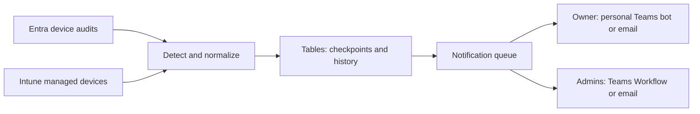
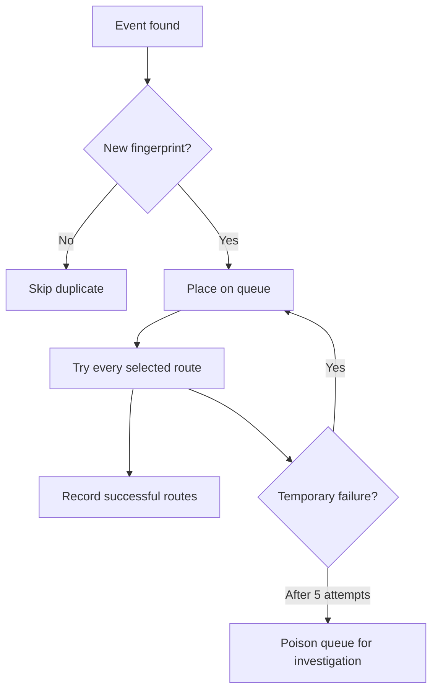

# Architecture and boundaries

The ready-to-run Node.js Function is committed in `function-package`; administrators do not build it or restore npm packages. The TypeScript source remains in `src`, and continuous integration proves that the committed bundle matches that source. Bot Service is deployed only when a personal Teams owner route is selected.

## Collection and readiness

Collection is disabled by default. The first deployment creates the Azure foundation and assigns runtime permissions, but polling does not begin until administrators configure destination prerequisites and prove every selected route through a protected synthetic endpoint. The endpoint is function-key protected, works only while collection is paused, and invokes the normal dispatch path. A fingerprint binds proof to the exact routing and destination configuration; changing it invalidates enablement proof.

Synthetic tests prove the delivery path, not Microsoft Graph polling, audit ingestion, device normalization, or timer execution. After collection is enabled, administrators must still perform approved real registration, enrollment, and compliance drills.

The Entra timer queries `GET /auditLogs/directoryAudits` every five minutes with a configurable overlap. It accepts successful `Register device` and `Add device` operations, finds device and user targets by type or properties rather than array position, and fingerprints the immutable audit ID.

The Intune timer queries `GET /deviceManagement/managedDevices` every 15 minutes. The first observation establishes a compliance baseline. The recommended zero-hour enrollment lookback suppresses enrollment backfill. An administrator can explicitly select a positive, bounded lookback so a recent `enrolledDateTime` produces an enrollment notification. Later compliance state differences produce transition events without collapsing `unknown`, `error`, and `inGracePeriod` into a boolean.

Registration actor, explicit owner, Entra device ID, and Intune managed-device ID remain distinct. When an audit has no explicit owner, the registering user is the end-user recipient while remaining identified as the actor. Registration and enrollment are separate lifecycle facts even when they correlate to the same Entra device ID.

## State and retries

- `DeviceNotificationState` stores watermarks, snapshots, and Teams conversation references.
- `DeviceEventFingerprints` reserves normalized events before queueing and suppresses overlapping audit polls.
- `DeviceNotificationHistory` records each event, audience, and transport delivery.
- `device-notifications` is the outbox. Azure Functions retries failed deliveries five times before moving them to the standard poison queue.

One retryable route failure does not prevent attempts to other routes. Successful routes are recorded and skipped on queue retry. Stale pending event reservations are recovered after 15 minutes so a Function termination cannot permanently suppress an event. Delivery is at least once: a process termination after an external service accepts a message but before history is recorded can still produce a duplicate.

Each evaluated route also emits a versioned, administrator-safe delivery result. Canonical keys include the tenant, namespaced event type, stable event ID, and logical route ID. A read-only legacy-key fallback recognizes delivered and fresh pending legacy rows during upgrade; the two row keys cannot provide a transactional cutover after a legacy reservation becomes stale. See [Notification contracts](notification-contracts.md).

An unavailable route is different from a retryable failure. For example, a missing Teams personal conversation or a route with no configured destination cannot prove delivery and may be consumed without retry. The readiness gate exists to prevent collection until these prerequisites have been tested. Administrators must monitor warnings and delivery history rather than treating queue completion as message receipt.

## Delivery

Teams personal messages use an Azure Bot with a user-assigned managed identity. The Teams app must be installed for the user; its installation activity supplies the supported conversation reference used for proactive messages. The service does not misuse Graph migration permissions or delegated user tokens.

Admin Teams delivery uses a Power Automate Workflows webhook bound to a configured channel or chat. Workflow ownership and its callback URL must be managed as credentials. The URL is present in the local azd environment and Function App configuration. Email uses Graph `sendMail` from one shared mailbox, authorized by Exchange Application RBAC rather than tenant-wide Entra `Mail.Send`.

## Destructive-action boundary

No runtime path writes device state or compliance policy. Administrative links are created only from validated identifiers and open Microsoft admin experiences where the signed-in administrator's normal authorization applies. The only tenant writes performed during setup are exact managed-identity Graph role assignments and optional ownership-recorded Exchange Application RBAC objects.

## Current scope

This release completes the three requested end-to-end scenarios. Grace-deadline reminders, stale/duplicate/ownership/enrollment-failure events, ticket/remediation webhooks, acknowledgement workflows, and optional Defender or certificate enrichment are intentionally later phases. None requires a destructive device action.
